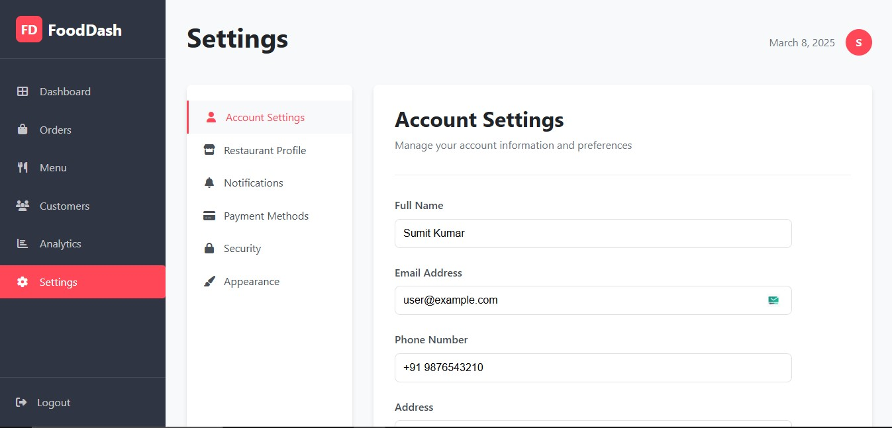

🌐 Live Demo 🔗 Live Demo(https://sumit1003.github.io/Food-Dash/)

# 🍔 FoodDash - Admin Dashboard

FoodDash is a **responsive** and **dynamic** admin dashboard built using **HTML, CSS, and JavaScript**. It provides insights and management features for food delivery businesses.

## 🚀 Features

- 📊 **Analytics Dashboard** - View total sales, orders, and new customers.
- ⚙ **Settings Page** - Manage user profile and preferences.
- 📦 **Order Management** - Track and update order statuses.
- 🌙 **Dark Mode Support** _(If applicable)_
- 📱 **Fully Responsive** Design.

## 📦 Project Structure

📁 FoodDash
├── 📁 assets/ (Images, Icons, etc.)
├── 📄 index.html (Main Dashboard)
├── 📄 Analytics.html (Analytics Page)
├── 📄 settings.html (Settings Page)
├── 📜 dashboard.css (Global Dashboard Styles)
├── 📜 Analytics.css (Analytics Styles)
├── 📜 settings.css (Settings Styles)
├── 📜 analytics.js (Analytics Logic)
├── 📜 settings.js (Settings Logic)
├── 📄 README.md (This File)

## 📦 Installation & Usage

1. **Clone the Repository**

   ```sh
   git clone https://github.com/yourusername/FoodDash.git

   ```

2. **Open the Project in Your Code Editor**

Simply open index.html in your browser.

💻 Technologies Used
HTML5
CSS3 (Flexbox, Grid, Animations)
JavaScript (DOM Manipulation, Event Listeners)

🛠 Future Improvements

✅ Order filtering & search
✅ User authentication
✅ Dark mode toggle

📸 Screenshots

### 📊 Dashboard Page


### 📈 Menu Page


### ⚙ Settings Page



👨‍💻 Author
SUMIT
📧 Email: sk6306210@gmail.com
🔗 GitHub: github.com/sumit1003

---

### ✅ **Final Steps**

1. **Save the README.md file** after fixing the issues.
2. **Push the updated file to GitHub**:
   ```sh
   git add README.md
   git commit -m "Updated README with fixed formatting and screenshots"
   git push origin main
   ```
